# ARCHOSC-Assignment-A-ALKAYYAL

# Lab 2 Placeholder

## Workspace Folder Structure
I went to my Workspace folder, created an ArchOSC Assignment folder, and inside it a Pictures folder for screenshots.

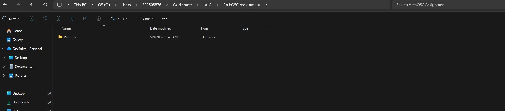

## Opening The Terminal
I right-clicked inside my `GitHub and CICD` folder and selected "Open in Terminal", then ran `git init` to create a new local Git repository.
 
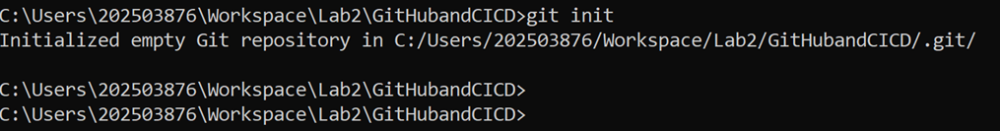

## Created GitHub Repository
I logged into GitHub, clicked the green "New" button, and created a private repository named ARCHOSC-Assignment-A-ALKAYYAL with a README file and Visual Studio Git ignore.
 
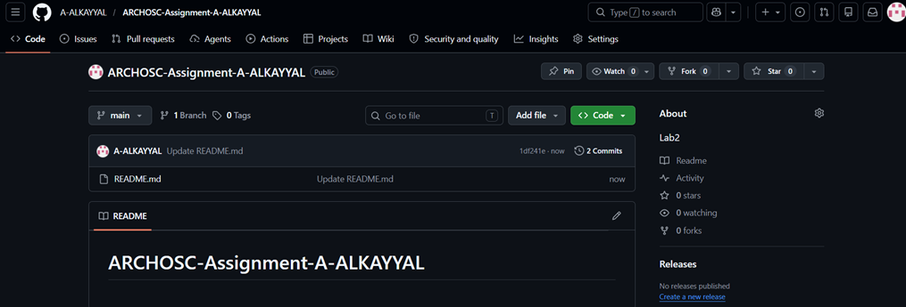

## Linking Local Repo to GitHub
I ran git remote add origin https://github.com/A-ALKAYYAL/ARCHOSC-Assignment-A-ALKAYYAL to connect my local repository to GitHub, then used git pull origin main to fetch the README file from the online repo.
 
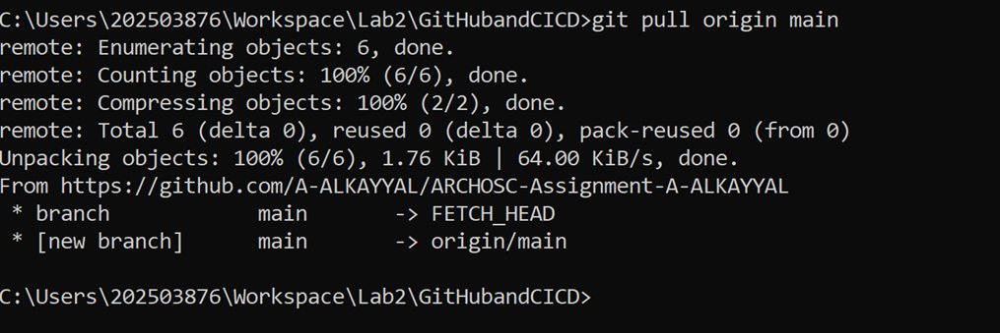

## Created Basic Website
I opened VS Code, created a new file, pasted the HTML code, and saved it as index.html inside my workspace folder. I then double-clicked the file to view the website in my browser.
 
 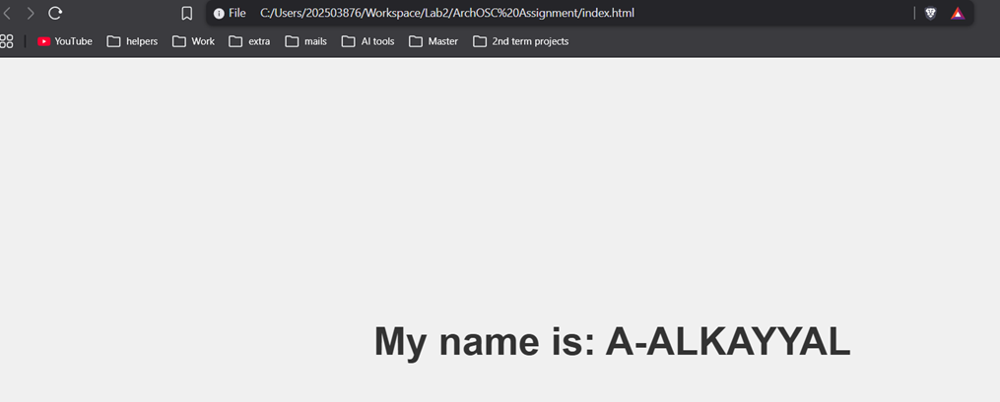

## Updated Local Repository
I ran git status to see untracked files, used git add . to stage all files, then ran git commit -m "new files" to save them to my local repository.

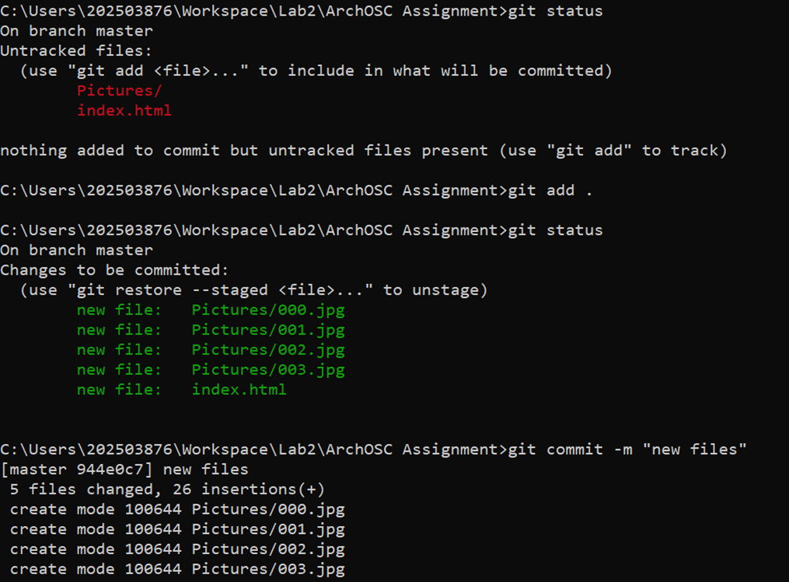
 
## Pushed Local Repository to GitHub
I ran git branch -m master main to rename my branch, then used git push -u origin main to upload my local repository to GitHub.
 
 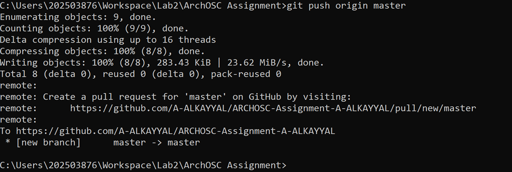

 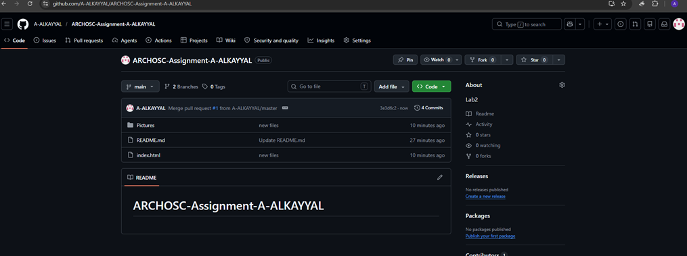

## Improve your website.
Change 1 – Gradient Background
Changed solid gray to purple-blue gradient.
Change 2 – Gold Name with Blur Box
Made name gold (#ffd700) and added rounded semi-transparent box with blur.
 
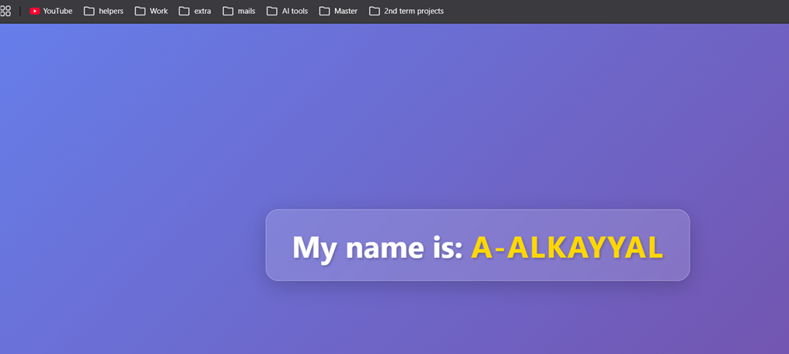

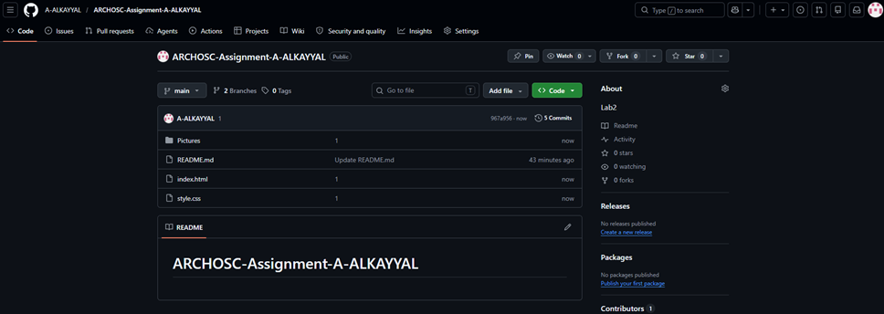
 
```html
<!DOCTYPE html>
<html lang="en">
<head>
    <meta charset="UTF-8">
    <meta name="viewport" content="width=device-width, initial-scale=1.0">
    <title>Centered Name | A-ALKAYYAL</title>
    <link rel="stylesheet" href="style.css">
</head>
<body>
    <h1>My name is: <span class="name">A-ALKAYYAL</span></h1>
</body>
</html>
```

```css
body {
    display: flex;
    justify-content: center;
    align-items: center;
    height: 100vh;
    margin: 0;
    font-family: 'Segoe UI', Tahoma, Geneva, Verdana, sans-serif;
    background: linear-gradient(135deg, #667eea 0%, #764ba2 100%);
}

h1 {
    font-size: 3rem;
    color: white;
    background: rgba(255, 255, 255, 0.15);
    padding: 1.5rem 2.5rem;
    border-radius: 20px;
    backdrop-filter: blur(10px);
    box-shadow: 0 8px 32px rgba(0, 0, 0, 0.2);
    border: 1px solid rgba(255, 255, 255, 0.3);
    text-shadow: 2px 2px 4px rgba(0, 0, 0, 0.2);
}

.name {
    color: #ffd700;
    font-weight: bold;
    letter-spacing: 2px;
}
```

## Deployed Website to GitHub Pages
I went to Settings → Pages, set branch to main, and saved. Then I clicked the deployment link to view my live website.
 
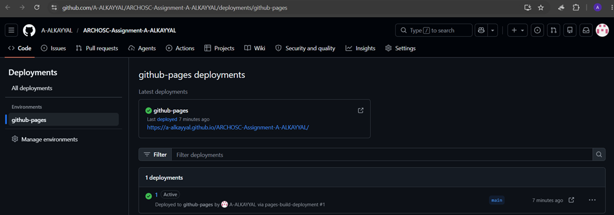
