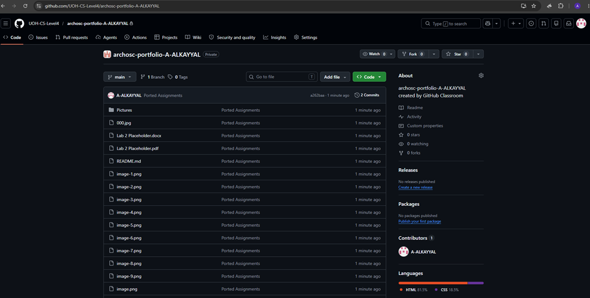
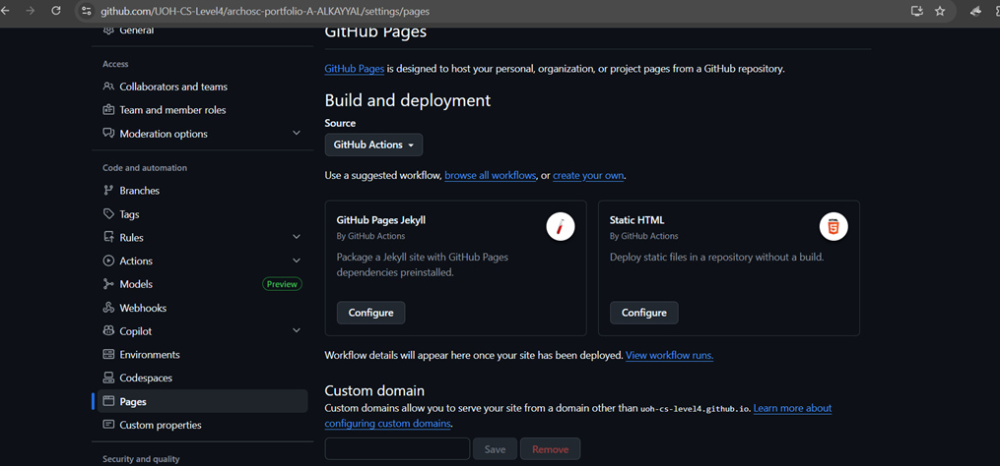
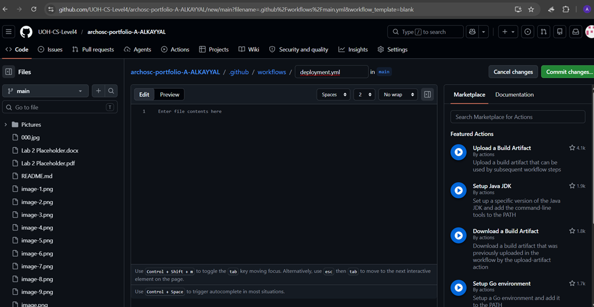
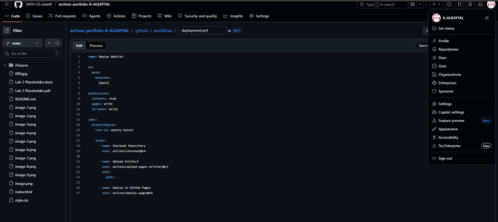
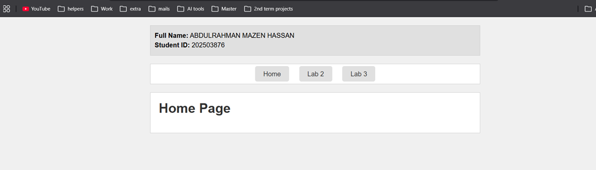
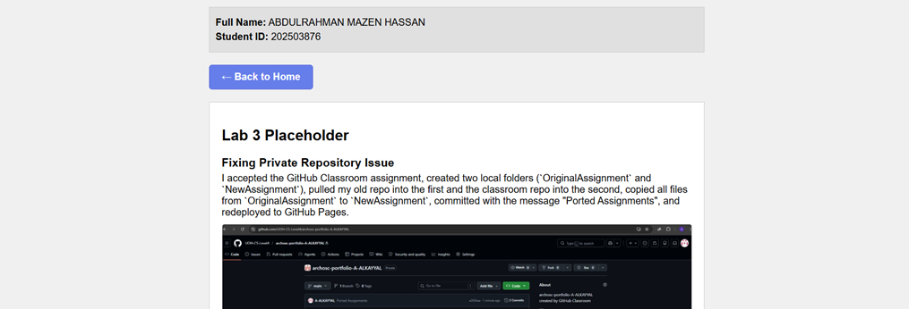

# Lab 3 Placeholder

## Fixing Private Repository Issue

I accepted the GitHub Classroom assignment, created two local folders (OriginalAssignment and NewAssignment), pulled my old repo into the first and the classroom repo into the second, copied all files from OriginalAssignment to NewAssignment, committed with the message "Ported Assignments", and redeployed to GitHub Pages.

 

## Section One: Move Project To Be Hosted Using GitHub Actions
 
 

## GitHub Actions & YAML Setup

I went to Settings → Pages, unpublished the site, changed source to GitHub Actions, then went to Actions → New Workflow → "Set up a workflow yourself", and renamed main.yml to deployment.yml.

 
## Writing YAML

I named the workflow "Deploy Website", set it to run on pushes to main, added permissions for Pages, then used checkout, upload-artifact, and deploy-pages actions to publish the site.

 
## Committing and Running the Pipeline

I committed the deployment.yml file, went to the Actions tab to watch the pipeline run step-by-step, then returned to Settings → Pages to get the live link to my deployed site.
I added all my lab content (text and images) to a new HTML page, linked both pages together using a hyperlink or navbar, and added a final section explaining how I connected them.
I created a navigation bar using <a href="index.html">Home</a> and <a href="page2.html">Page 2</a> inside a <nav> element. The href attribute points to each HTML file, allowing users to click between pages. I then added CSS styling to make the buttons look consistent and added hover effects. By placing the same navigation code on both pages, users can seamlessly move back and forth between the Home page and Lab 2 page.
 
 

